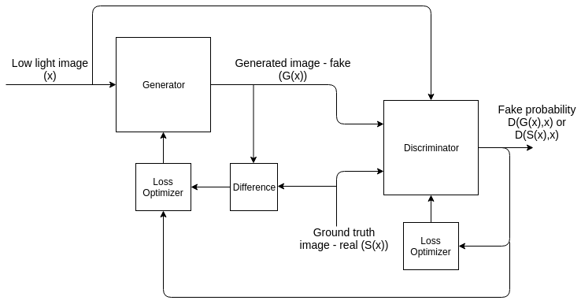
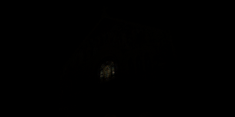
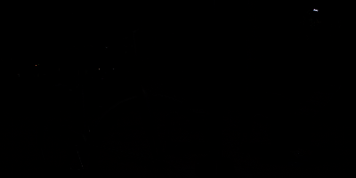

# Introduction

Course project for EE610 

Authors: [Shrinivas](www.shrinivas.com ),[Srivatsan](www.srivatsan.com)

The project aims at achieving an image transformation from a low exposure image taen in a dimly lit environment to that taken by a long exposure camera.the dataset that has been used is the [SID](https://github.com/cchen156/Learning-to-See-in-the-Dark ). Dataset prepared thanks to C. Chen et. al. For detailed analysis please refer to the project report named report.pdf .

## Architecture

The model is basically a conditional GAN with the generator trained on the adverserial loss and L1 error while the discriminator is trained on purely adverserial error.



*Fig 1.1: Model Pipeline *


## Setup,train and  test

### Pre-Requisites

First clone this repository using the following command and enter the repository.

```bash
foo@bar:~$git clone https://github.com/lalit184/SeeInTheDark.git
foo@bar:~$cd SeeInTheDark
```

Once your are done install the prerequisites using the following command...

```bash
foo@bar:~$pip install -r requirements.txt
```

### Dataset preperation

- First move all your Training images and their ground truths into ./TrainInputs and the test images to the ./TestInputs directory in your current working directory. Make sure that all these images are in .ARW  format. 

- Create a dictionary consisting of the image name as the key and entry is a dictionary consisting of the target image name and the relative exposure level to achieve and save it as a json file in your working directory. For eg:

  ```json
  {
    "./TrainImages/10193_05_0.04s.ARW": {"Target": "./Sony/long/10193_00_10s.ARW","Exposure": 250.0}
  }
  ```

  

- Create a dictionary consisting of the input image name and their target exposure and save it as a json file in the wroking directory. For eg:

```json
{
  "./TestInputs/short/10193_05_0.04s.ARW":250
}
```

### Execute

To train the neural net run the following command. The loss plots for both validation and training shall be stored in the working directory and the checkpoint is stored in ./checkpoinnt folder .Feel free to use our [checkpoint](www.checkpoint.com)

```shell
foo@bar:~$python execute.py -m train -d <training json file> -c <checkpoint to continue from>
```

To test it on some images run the following..gi

```shell
foo@bar:~$python execute.py -m test -d <test json file > -c <checkpoint to use>
```


# Results 

| Input                    | Output                    | Ground Truth          |
| ------------------------ | ------------------------- | --------------------- |
|  |  |  |
|   |  |  |
|   |  |  |
|   |  |  |
|   |  |  |

